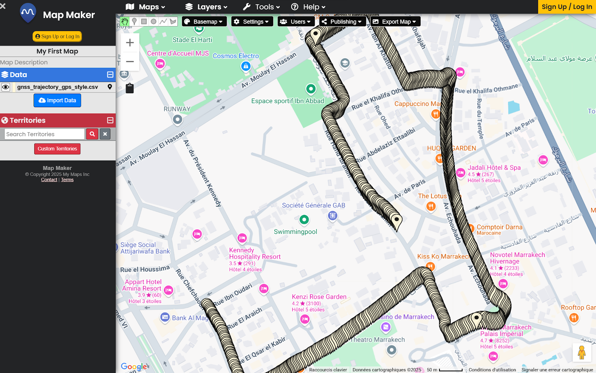

# MoMo_SAM - Real-time LiDAR-Inertial SLAM with Global UTM Georeferencing

**Authors**: HADDAD MOHAMMED (Lead), Omar Guenoun, Nour El houda Raguige  
**Contact**: [mohhd2045@gmail.com](mailto:mohhd2045@gmail.com)

<p align="center">
  
  
</p>

<p align="center">
  
</p>

<p align="center">
  
  
  
  
</p>

## Overview

**MoMo_SAM** is a significantly enhanced and optimized version of the renowned **LIO-SAM** (LiDAR-Inertial Odometry via Smoothing and Mapping) framework. While preserving LIO-SAM's robust mathematical foundations and proven SLAM architecture, MoMo_SAM introduces revolutionary georeferencing capabilities and advanced optimizations for modern mapping applications.

### Key Innovation

MoMo_SAM eliminates the traditional post-processing workflow by providing **direct UTM coordinate output** from the SLAM process. This breakthrough enables real-time generation of globally referenced maps ready for immediate integration with GIS platforms and professional visualization tools.

## LIO-SAM Architecture Foundation

<p align="center">
  
</p>

### Core LIO-SAM Components

**LIO-SAM** employs a sophisticated four-module architecture optimized for real-time LiDAR-Inertial SLAM:

#### 1. Image Projection Module
- **Point Cloud Deskewing**: Compensates for sensor motion during point cloud acquisition
- **Range Image Generation**: Projects 3D point clouds to 2D range images for efficient processing
- **Motion Compensation**: Uses IMU data for accurate point cloud motion correction

#### 2. Feature Extraction Module
- **Edge Feature Detection**: Identifies geometric edges for precise localization
- **Planar Feature Detection**: Extracts surface features for robust mapping
- **Feature Association**: Matches features between consecutive frames

#### 3. IMU Preintegration Module
- **High-Frequency IMU Processing**: Processes IMU data at sensor frequency (typically 200-500Hz)
- **Bias Estimation**: Continuously estimates and corrects IMU biases
- **Motion Prediction**: Provides initial guess for LiDAR odometry

#### 4. Map Optimization Module
- **Factor Graph SLAM**: Utilizes GTSAM for sophisticated optimization
- **Loop Closure Detection**: Automatic detection and correction of accumulated drift
- **Global Consistency**: Maintains globally consistent maps through optimization

<p align="center">
  
  
</p>

### Mathematical Foundation

LIO-SAM employs advanced mathematical frameworks:
- **Factor Graph Optimization**: Non-linear least squares optimization using GTSAM
- **IMU Preintegration Theory**: Efficient integration of high-frequency IMU measurements
- **Scan Matching**: ICP-based point cloud alignment with motion compensation
- **Loop Closure**: Place recognition and pose graph optimization

## MoMo_SAM Enhancements

### Revolutionary Improvements Over LIO-SAM

**MoMo_SAM** takes the proven LIO-SAM architecture and adds powerful enhancements detailed in our improvement documentation at `./src/MoMo_SAM/config/doc/`:

| LIO-SAM (Original) | MoMo_SAM (Enhanced) |
|---|---|
| **Local Coordinate SLAM** | **Global UTM Georeferencing** |
| Basic GPS Integration | **Dual GPS Processing Architecture** |
| Post-processing Required | **Real-time Global Coordinates** |
| Standard Feature Extraction | **Livox-Optimized Processing** |
| Basic Error Handling | **Comprehensive Error Recovery** |
| Local Map Output | **GIS-Ready Professional Maps** |

**Result**: Zero post-processing + Professional GIS integration

### Professional Visualization Capabilities

Unlike standard LIO-SAM output, MoMo_SAM produces maps ready for immediate use in professional visualization platforms:

#### Cesium Web-Based 3D Globe Visualization
<p align="center">
  
  
  
</p>

**Cesium Integration Features:**
- Direct UTM coordinate loading
- Real-time 3D globe visualization
- Web-based accessibility
- Integration with satellite imagery

#### MeshLab Professional 3D Processing
<p align="center">
  
  
</p>

**MeshLab Capabilities:**
- Advanced 3D mesh processing
- Point cloud analysis and filtering
- Professional rendering and export
- Research-grade measurement tools

#### Potree High-Performance Web Viewer
<p align="center">
  
  
</p>

**Potree Web Features:**
- Massive point cloud rendering
- Web-based collaboration
- Interactive measurements
- Multi-platform accessibility

#### Advanced GPS Integration and Mapping
<p align="center">
  
</p>

**Enhanced GPS Capabilities:**
- Dual GPS processing streams
- Real-time coordinate transformation
- Professional mapping integration
- Quality-based GPS filtering

## Key Features

### LIO-SAM Foundation
- **Proven SLAM Framework**: Battle-tested LiDAR-Inertial odometry and mapping
- **Factor Graph Optimization**: Advanced GTSAM-based pose and map optimization
- **Loop Closure Detection**: Automatic drift correction through place recognition
- **Multi-Sensor Fusion**: Tight coupling of LiDAR, IMU, and GPS measurements
- **Real-Time Performance**: Optimized for real-time operation up to 10Hz

### MoMo_SAM Revolutionary Enhancements

#### Direct UTM Georeferencing
- **Native Global Coordinates**: Output maps directly in UTM coordinate system
- **No Post-Processing**: Eliminates FlexCloud, PDAL, or manual coordinate transformation
- **Real-Time Performance**: Maintains 10Hz processing with <10% georeferencing overhead
- **Automatic Coordinate Detection**: Auto-detects UTM zone from GPS data

#### Advanced Dual GPS Integration
- **Dual GPS Processing**: Separate local/global coordinate streams for optimal SLAM stability
- **Quality Filtering**: Advanced GPS validation and quality assessment
- **RTK/DGPS Support**: Professional-grade positioning integration
- **Coordinate System Flexibility**: WGS84, UTM, custom datum support

#### Enhanced Livox Support
- **Virtual Ring Processing**: 64 virtual rings from 6 physical Livox scanning lines
- **Motion Compensation**: SLERP-based deskewing for continuous scanning patterns
- **Quality-Based Filtering**: Tag-based defective pixel removal
- **Adaptive Feature Extraction**: Dynamic thresholds optimized for irregular point distributions

## Preparing Data for MoMo_SAM

### Point Cloud Data Requirements

MoMo_SAM requires properly formatted point cloud data with specific fields for optimal performance:

#### Supported LiDAR Sensors

**Mechanical LiDAR Sensors:**
- **Velodyne**: VLP-16, VLP-32, HDL-64E, VLS-128
- **Ouster**: OS0, OS1, OS2 series (16, 32, 64, 128 channels)
- **Hesai**: PandarXT, Pandar64, Pandar128

**Non-Repetitive LiDAR Sensors:**
- **Livox HAP**: Optimized with virtual ring processing
- **Livox Mid-40/70**: Enhanced motion compensation
- **Livox Horizon**: Advanced feature extraction

#### Point Cloud Format Requirements

**Essential Point Fields:**
```cpp
struct PointXYZIRT {
    float x, y, z;          // 3D coordinates
    float intensity;        // Reflectivity value
    uint16_t ring;         // LiDAR ring/channel number
    float time;            // Relative timestamp within scan
}
```

**Point Time Channel:**
- **Format**: Relative time in seconds within each scan
- **Range**: 0.0 to scan_period (typically 0.1s for 10Hz rotation)
- **Purpose**: Motion compensation and point cloud deskewing
- **Critical**: Accurate timestamps essential for high-quality SLAM

**Ring Channel:**
- **Mechanical LiDAR**: Hardware ring number (0 to N_SCAN-1)
- **Livox LiDAR**: Virtual ring assignment based on vertical angle
- **Purpose**: Organized point cloud processing and feature extraction

#### Livox-Specific Enhancements

**Virtual Ring Assignment:**
```cpp
// Livox HAP: 6 physical lines → 64 virtual rings
double vertical_angle = asin(point.z / range) * 180.0 / M_PI;
int virtual_ring = (vertical_angle - MIN_ANGLE) / (MAX_ANGLE - MIN_ANGLE) * 64;
```

**Quality Tag Filtering:**
- **Tag 0x00**: Normal pixel (processed)
- **Tag 0x01**: Defective pixel (filtered)
- **Tag 0x02**: Isolated pixel (filtered)

### IMU Data Requirements

#### IMU Specifications

**Required IMU Type:**
- **9-Axis IMU**: Accelerometer + Gyroscope + Magnetometer
- **Minimum Frequency**: 200Hz (recommended 400-500Hz)
- **Quality**: Industrial-grade preferred for professional mapping

**Tested IMU Models:**
- **Microstrain 3DM-GX5-25**: 500Hz, high precision
- **Xsens MTi-G-710**: 400Hz, GNSS/INS integration
- **SBG Ellipse-N**: 200Hz, navigation-grade
- **Vectornav VN-100**: 800Hz, tactical-grade

#### IMU Data Format

**Required Topics:**
```yaml
imu_topic: "/imu/data"                    # sensor_msgs/Imu
acceleration_topic: "/imu/acceleration"   # Optional
angular_velocity_topic: "/imu/gyro"      # Optional
magnetic_field_topic: "/imu/magnetic"    # Optional
```

**Data Requirements:**
- **Linear Acceleration**: 3-axis in m/s²
- **Angular Velocity**: 3-axis in rad/s
- **Orientation**: Quaternion (if available)
- **Covariance**: Noise characteristics for each measurement

#### IMU Coordinate Frame

**Frame Alignment:**
- **X-axis**: Forward direction
- **Y-axis**: Left direction (ROS REP-105)
- **Z-axis**: Upward direction
- **Rotation**: Right-hand coordinate system

**Extrinsic Calibration:**
```yaml
# IMU to LiDAR transformation
extrinsicTrans: [0.0, 0.0, 0.0]          # Translation [x, y, z]
extrinsicRot: [1.0, 0.0, 0.0,             # Rotation matrix
               0.0, 1.0, 0.0,             # 3x3 row-major
               0.0, 0.0, 1.0]
extrinsicRPY: [1.0, 0.0, 0.0,             # RPY transformation
               0.0, 1.0, 0.0,             # (may differ from Rot)
               0.0, 0.0, 1.0]
```

### GPS Data Requirements

#### GPS Hardware Specifications

**Recommended GPS Types:**
- **RTK GPS**: Sub-decimeter accuracy (preferred)
- **DGPS**: Meter-level accuracy (professional)
- **Standard GNSS**: 3-5m accuracy (consumer)

**Supported GPS Modules:**
- **u-blox ZED-F9P**: RTK with 1cm accuracy
- **Trimble R10**: Survey-grade RTK receiver
- **Septentrio mosaic-H**: Multi-frequency GNSS
- **NovAtel PwrPak7**: Professional navigation receiver

#### GPS Data Format

**Standard GPS Topic:**
```yaml
gps_topic: "/gps/fix"                     # sensor_msgs/NavSatFix
```

**Enhanced Dual GPS Topics (MoMo_SAM):**
```yaml
gps_topic_local: "/gnss/local/odom"       # nav_msgs/Odometry
gps_topic_global: "/gnss/global/odom"     # nav_msgs/Odometry
```

**NavSatFix Requirements:**
- **Latitude/Longitude**: WGS84 decimal degrees
- **Altitude**: Ellipsoidal height in meters
- **Covariance**: Position uncertainty matrix
- **Status**: Fix quality and satellite count

#### GPS Quality Parameters

**Quality Thresholds:**
```yaml
gps_cov_threshold: 8.0                    # Position covariance (m²)
pose_cov_threshold: 25.0                  # Pose covariance (m²)
min_satellites: 6                         # Minimum satellite count
hdop_threshold: 3.0                       # Horizontal DOP limit
```

**Quality Assessment:**
- **RTK Fixed**: Covariance < 0.1 m²
- **RTK Float**: Covariance < 1.0 m²
- **DGPS**: Covariance < 4.0 m²
- **Standard GPS**: Covariance < 25.0 m²

### Data Synchronization

#### Temporal Alignment

**Timestamp Requirements:**
- **Common Time Base**: All sensors synchronized to system time
- **High Resolution**: Nanosecond precision preferred
- **Consistent Headers**: ROS timestamp in message headers

**Synchronization Methods:**
1. **Hardware Sync**: External trigger signal (preferred)
2. **Software Sync**: NTP time synchronization
3. **Post-Processing**: Timestamp alignment algorithms

#### Frame Transformations

**TF Tree Structure:**
```
base_link
├── imu_link
├── lidar_link
└── gps_link
```

**Required Transforms:**
- **base_link → imu_link**: IMU mounting position
- **base_link → lidar_link**: LiDAR mounting position  
- **base_link → gps_link**: GPS antenna position

### Data Quality Validation

#### Pre-Processing Checks

**Point Cloud Validation:**
- Verify ring and time channels present
- Check for NaN/infinite values
- Validate intensity ranges
- Confirm scan timing consistency

**IMU Validation:**
- Check measurement frequency
- Verify coordinate frame alignment
- Validate noise characteristics
- Confirm bias stability

**GPS Validation:**
- Verify coordinate system (WGS84)
- Check fix quality indicators
- Validate covariance values
- Confirm satellite visibility

#### Common Data Issues

**Point Cloud Problems:**
- Missing time channel → Poor motion compensation
- Incorrect ring assignment → Feature extraction errors
- High noise → Reduced mapping accuracy
- Inconsistent timing → SLAM failures

**IMU Problems:**
- Low frequency → Inadequate motion prediction
- Poor calibration → Drift accumulation
- Frame misalignment → Coordinate errors
- High noise → Reduced precision

**GPS Problems:**
- Poor signal quality → Georeferencing errors
- Coordinate system mismatch → Geographic offset
- High latency → Synchronization issues
- Insufficient satellites → Quality degradation

## Launch Files and Execution

### Main Launch File

The primary launch file `run.launch.py` orchestrates all MoMo_SAM components:

```python
# Core MoMo_SAM launch configuration
ros2 launch momo_sam run.launch.py
```

#### Launch File Components

**1. Parameter Configuration:**
```python
params_declare = DeclareLaunchArgument(
    'params_file',
    default_value=os.path.join(share_dir, 'config', 'params.yaml'),
    description='Path to the ROS2 parameters file to use.')
```

**2. Transform Publishers:**
```python
Node(
    package='tf2_ros',
    executable='static_transform_publisher',
    arguments='0.0 0.0 0.0 0.0 0.0 0.0 map odom'.split(' '),
    parameters=[parameter_file],
    output='screen'
)
```

**3. Robot State Publisher:**
```python
Node(
    package='robot_state_publisher',
    executable='robot_state_publisher',
    name='robot_state_publisher',
    parameters=[{
        'robot_description': Command(['xacro', ' ', xacro_path])
    }]
)
```

**4. MoMo_SAM Core Nodes:**
```python
# IMU Preintegration Node
Node(
    package='momo_sam',
    executable='momo_sam_imuPreintegration',
    name='momo_sam_imuPreintegration',
    parameters=[parameter_file],
    output='screen'
),

# Image Projection Node  
Node(
    package='momo_sam',
    executable='momo_sam_imageProjection',
    name='momo_sam_imageProjection',
    parameters=[parameter_file],
    output='screen'
),

# Feature Extraction Node
Node(
    package='momo_sam',
    executable='momo_sam_featureExtraction',
    name='momo_sam_featureExtraction',
    parameters=[parameter_file],
    output='screen'
),

# Map Optimization Node (Core SLAM)
Node(
    package='momo_sam',
    executable='momo_sam_mapOptimization',
    name='momo_sam_mapOptimization',
    parameters=[parameter_file],
    output='screen'
)
```

**5. Visualization:**
```python
Node(
    package='rviz2',
    executable='rviz2',
    name='rviz2',
    arguments=['-d', rviz_config_file],
    output='screen'
)
```

### Enhanced GPS Converter Launch

For advanced georeferencing capabilities, launch the enhanced GPS converter:

```python
# Enhanced GPS processing for dual coordinate streams
ros2 launch momo_sam enhanced_dual_gps_converter.launch.py
```

#### GPS Converter Configuration

**Launch Arguments:**
- **input_gps_topic**: Raw GPS input (`/gps/fix`)
- **output_local_topic**: Local coordinate output (`/gnss/local/odom`)
- **output_global_topic**: Global UTM output (`/gnss/global/odom`)
- **utm_zone**: UTM zone number (auto-detected if not specified)
- **utm_hemisphere**: Northern/Southern hemisphere (`N` or `S`)

**Quality Parameters:**
- **gps_quality_threshold**: Position covariance threshold (8.0 m²)
- **enable_quality_filtering**: GPS quality validation (true)
- **origin_establishment_samples**: Samples for origin calculation (5)
- **origin_variance_threshold**: Origin stability requirement (10.0 m)

### Complete Launch Sequence

**1. Basic MoMo_SAM Launch:**
```bash
# Terminal 1: Launch core SLAM system
ros2 launch momo_sam run.launch.py

# Terminal 2: Launch GPS converter (if using raw GPS data)
ros2 launch momo_sam enhanced_dual_gps_converter.launch.py

# Terminal 3: Play sensor data
ros2 bag play your_sensor_data.bag
```

**2. Custom Parameter Launch:**
```bash
# Launch with custom parameters
ros2 launch momo_sam run.launch.py params_file:=/path/to/custom_params.yaml

# Launch GPS converter with custom UTM zone
ros2 launch momo_sam enhanced_dual_gps_converter.launch.py utm_zone:=33 utm_hemisphere:=N
```

**3. Save Georeferenced Maps:**
```bash
# Save maps with default resolution
ros2 service call /momo_sam/save_map momo_sam/srv/SaveMap

# Save maps with custom resolution and destination
ros2 service call /momo_sam/save_map momo_sam/srv/SaveMap "{resolution: 0.1, destination: /path/to/output}"
```

## Installation

### Dependencies

**ROS2 Humble Requirements:**
```bash
sudo apt install ros-humble-perception-pcl \
                 ros-humble-pcl-msgs \
                 ros-humble-vision-opencv \
                 ros-humble-xacro \
                 ros-humble-robot-state-publisher \
                 ros-humble-tf2-ros
```

**GTSAM Installation:**
```bash
# Add GTSAM PPA
sudo add-apt-repository ppa:borglab/gtsam-release-4.1
sudo apt install libgtsam-dev libgtsam-unstable-dev
```

### Build Instructions

```bash
# Create workspace
mkdir -p ~/ros2_ws/src
cd ~/ros2_ws/src

# Clone repository
git clone https://github.com/HADDADmed/MoMo-SAM.git
cd MoMo-SAM

# Build
cd ~/ros2_ws
colcon build --packages-select momo_sam

# Source
source install/setup.bash
```

## Usage

### Basic Operation

```bash
# 1. Launch MoMo_SAM
ros2 launch momo_sam run.launch.py

# 2. Start data source
ros2 bag play sensor_data.bag

# 3. Save georeferenced maps
ros2 service call /momo_sam/save_map momo_sam/srv/SaveMap
```

### Output Files

**Standard Maps:**
- `GlobalMap.pcd` - Complete point cloud map
- `CornerMap.pcd` - Edge feature points
- `SurfMap.pcd` - Surface feature points
- `trajectory.pcd` - Robot trajectory

**Georeferenced Maps (MoMo_SAM Enhancement):**
- `GlobalMap_georef.pcd` - UTM coordinate map ready for GIS
- `CornerMap_georef.pcd` - UTM edge features
- `SurfMap_georef.pcd` - UTM surface features
- `trajectory_georef.pcd` - UTM trajectory
- `georeferencing_metadata.yaml` - Complete coordinate system information

## Technical Specifications

### Performance Metrics
- **Processing Rate**: 10-25Hz (faster than real-time)
- **Georeferencing Overhead**: <10% performance impact
- **Memory Usage**: Standard LIO-SAM + minimal coordinate transformation overhead
- **Coordinate Accuracy**: GPS-limited absolute accuracy + cm-level relative SLAM precision

### Supported Hardware
- **LiDAR**: Livox HAP/Mid, Ouster, Velodyne, Hesai
- **IMU**: 9-axis IMU (200Hz+ recommended)
- **GPS**: RTK/DGPS preferred, standard GNSS supported
- **Platform**: Ubuntu 20.04/22.04 with ROS2 Humble

## Documentation

### LIO-SAM Foundation Documentation
The original LIO-SAM architecture and mathematical foundations are documented at:
`/home/user/Desktop/LIO_SAM_BACKUP/LIO_SAM/src/LIO-SAM/config/doc`

### MoMo_SAM Enhancement Documentation
Complete details of our improvements and optimizations:

- **[Technical README](./src/MoMo_SAM/README.md)**: Detailed installation and configuration
- **[Georeferencing Implementation Guide](./src/MoMo_SAM/config/doc/GEOREFERENCING_IMPLEMENTATION_GUIDE.md)**: Revolutionary coordinate transformation system
- **[Session Summary](./src/MoMo_SAM/config/doc/SESSION_COMPACT_GEOREFERENCING.md)**: Complete validation and testing results
- **[Livox HAP Integration](./src/MoMo_SAM/config/doc/LIVOX_HAP_INTEGRATION.md)**: Advanced non-repetitive LiDAR support
- **[Advanced Optimizations](./src/MoMo_SAM/config/doc/LIVOX_HAP_ADVANCED_OPTIMIZATIONS.md)**: Performance improvements and enhancements
- **[Implementation Summary](./src/MoMo_SAM/config/doc/IMPLEMENTATION_SUMMARY.md)**: Overview of all system improvements

## LIO-SAM vs MoMo_SAM: Visual Comparison

### LIO-SAM Architecture
<p align="center">
  
  
</p>

### MoMo_SAM Enhanced Capabilities
<p align="center">
  
</p>

**The Difference**: LIO-SAM provides excellent local SLAM, while **MoMo_SAM delivers the same quality PLUS instant global georeferencing and professional visualization readiness.**

## Citation

### MoMo_SAM Citation
If you use MoMo_SAM in your research, please cite:
```
@software{momosam2025,
  title={MoMo_SAM: Real-time LiDAR-Inertial SLAM with Integrated Global UTM Georeferencing},
  author={Haddad, Mohammed and Guenoun, Omar and Raguige, Nour El houda},
  year={2025},
  email={mohhd2045@gmail.com},
  url={https://github.com/HADDADmed/MoMo-SAM},
  note={Enhanced LIO-SAM with direct georeferencing capabilities}
}
```

### Original LIO-SAM Citation
MoMo_SAM builds upon the excellent work of LIO-SAM:
```
@inproceedings{liosam2020shan,
  title={LIO-SAM: Tightly-coupled Lidar Inertial Odometry via Smoothing and Mapping},
  author={Shan, Tixiao and Englot, Brendan and Meyers, Drew and Wang, Wei and Ratti, Carlo and Rus Daniela},
  booktitle={IEEE/RSJ International Conference on Intelligent Robots and Systems (IROS)},
  pages={5135-5142},
  year={2020},
  organization={IEEE}
}
```

## Authors and Contributors

### Lead Author
**HADDAD MOHAMMED**  
Email: [mohhd2045@gmail.com](mailto:mohhd2045@gmail.com)  
Role: Project Lead, Architecture Design, and Georeferencing Implementation

### Technical Contributors
**Mrs. Omar Guenoun**  
Technical Contribution: Advanced GPS Integration and Coordinate System Implementation

**Ms. Nour El houda Raguige**  
Technical Contribution: Livox LiDAR Optimization and Performance Enhancement

## Contact

- **Primary Contact**: HADDAD MOHAMMED - [mohhd2045@gmail.com](mailto:mohhd2045@gmail.com)
- **Documentation**: [Technical Documentation](./src/MoMo_SAM/README.md)
- **Issues**: Create an issue in this repository

## License

MoMo_SAM is released under the **BSD-3-Clause License**, maintaining compatibility with the original LIO-SAM license.

## Acknowledgments

### LIO-SAM Foundation
MoMo_SAM is built upon the excellent work of the **LIO-SAM research team**:

**Original LIO-SAM Citation:**
```
@inproceedings{liosam2020shan,
  title={LIO-SAM: Tightly-coupled Lidar Inertial Odometry via Smoothing and Mapping},
  author={Shan, Tixiao and Englot, Brendan and Meyers, Drew and Wang, Wei and Ratti, Carlo and Rus Daniela},
  booktitle={IEEE/RSJ International Conference on Intelligent Robots and Systems (IROS)},
  pages={5135-5142},
  year={2020},
  organization={IEEE}
}
```

### Technical Dependencies
- **LIO-SAM Team**: Foundation SLAM implementation ([TixiaoShan/LIO-SAM](https://github.com/TixiaoShan/LIO-SAM))
- **GTSAM Library**: Georgia Tech Smoothing and Mapping for factor graph optimization
- **ROS2 Community**: Robust middleware platform for robotics applications
- **Point Cloud Library (PCL)**: Essential 3D processing capabilities
- **Eigen Library**: Linear algebra operations and mathematical computations

---

**Built on LIO-SAM excellence • Enhanced with revolutionary georeferencing • Ready for global applications**