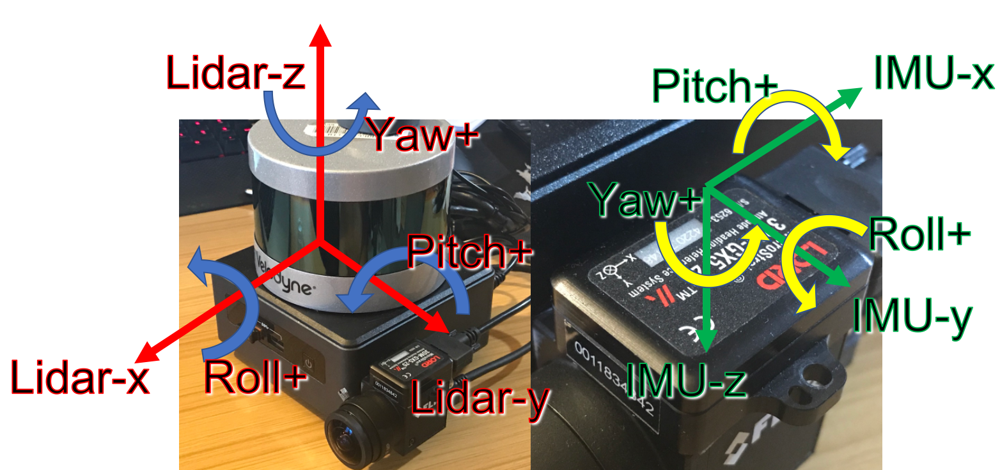

# MoMo_SAM - Real-time LiDAR-Inertial SLAM with Global UTM Georeferencing

<p align="center">
  
  
</p>

<p align="center">
  
  
  
  
</p>

## 🌍 **Advanced LiDAR-Inertial SLAM with Revolutionary Georeferencing**

**MoMo_SAM** is a significantly enhanced and optimized version of the renowned **LIO-SAM** (LiDAR-Inertial Odometry via Smoothing and Mapping) framework. While preserving LIO-SAM's robust mathematical foundations and proven SLAM architecture, MoMo_SAM introduces **groundbreaking georeferencing capabilities** and advanced optimizations for modern applications.

### 🏗️ **Built Upon LIO-SAM Excellence**

MoMo_SAM leverages the proven LIO-SAM architecture with its sophisticated multi-sensor fusion and factor graph optimization. The original LIO-SAM documentation and technical details can be found at `/home/user/Desktop/LIO_SAM_BACKUP/LIO_SAM/src/LIO-SAM/config/doc`.

## 📐 **LIO-SAM Architecture Foundation**

<p align="center">
  
</p>

### 🔧 **Core LIO-SAM Components**

**LIO-SAM** employs a sophisticated four-module architecture optimized for real-time LiDAR-Inertial SLAM:

#### 1. **Image Projection Module**
- **Point Cloud Deskewing**: Compensates for sensor motion during point cloud acquisition
- **Range Image Generation**: Projects 3D point clouds to 2D range images for efficient processing
- **Motion Compensation**: Uses IMU data for accurate point cloud motion correction

#### 2. **Feature Extraction Module** 
- **Edge Feature Detection**: Identifies geometric edges for precise localization
- **Planar Feature Detection**: Extracts surface features for robust mapping
- **Feature Association**: Matches features between consecutive frames

#### 3. **IMU Preintegration Module**
- **High-Frequency IMU Processing**: Processes IMU data at sensor frequency (typically 200-500Hz)
- **Bias Estimation**: Continuously estimates and corrects IMU biases
- **Motion Prediction**: Provides initial guess for LiDAR odometry

#### 4. **Map Optimization Module**
- **Factor Graph SLAM**: Utilizes GTSAM for sophisticated optimization
- **Loop Closure Detection**: Automatic detection and correction of accumulated drift
- **Global Consistency**: Maintains globally consistent maps through optimization

<p align="center">
  
  
</p>

### 🔬 **Mathematical Foundation**

LIO-SAM employs advanced mathematical frameworks:
- **Factor Graph Optimization**: Non-linear least squares optimization using GTSAM
- **IMU Preintegration Theory**: Efficient integration of high-frequency IMU measurements
- **Scan Matching**: ICP-based point cloud alignment with motion compensation
- **Loop Closure**: Place recognition and pose graph optimization

## 🚀 **MoMo_SAM: Enhanced & Optimized LIO-SAM**

### 🎯 **Revolutionary Improvements Over LIO-SAM**

**MoMo_SAM** takes the proven LIO-SAM architecture and adds powerful enhancements detailed in our improvement documentation at `./src/MoMo_SAM/config/doc/`:

| LIO-SAM (Original) | MoMo_SAM (Enhanced) |
|---|---|
| **Local Coordinate SLAM** | **Global UTM Georeferencing** ✨ |
| Basic GPS Integration | **Dual GPS Processing Architecture** |
| Post-processing Required | **Real-time Global Coordinates** |
| Standard Feature Extraction | **Livox-Optimized Processing** |
| Basic Error Handling | **Comprehensive Error Recovery** |
| Local Map Output | **GIS-Ready Professional Maps** 🗺️ |

**Result**: 🚀 **Zero post-processing + Professional GIS integration**

### 📊 **MoMo_SAM Professional Visualization Capabilities**

Unlike standard LIO-SAM output, MoMo_SAM produces maps ready for immediate use in professional visualization platforms:

#### 🌐 **Cesium Web-Based 3D Globe Visualization**
<p align="center">
  
  
  
</p>

**Cesium Integration Features:**
- Direct UTM coordinate loading
- Real-time 3D globe visualization
- Web-based accessibility
- Integration with satellite imagery

#### 🔬 **MeshLab Professional 3D Processing**
<p align="center">
  
  
</p>

**MeshLab Capabilities:**
- Advanced 3D mesh processing
- Point cloud analysis and filtering
- Professional rendering and export
- Research-grade measurement tools

#### 📱 **Potree High-Performance Web Viewer**
<p align="center">
  
  
  
</p>

**Potree Web Features:**
- Massive point cloud rendering
- Web-based collaboration
- Interactive measurements
- Multi-platform accessibility

#### 🗺️ **Advanced GPS Integration and Mapping**
<p align="center">
  
</p>

**Enhanced GPS Capabilities:**
- Dual GPS processing streams
- Real-time coordinate transformation
- Professional mapping integration
- Quality-based GPS filtering

---

## 🌟 **Key Features**

### 🏗️ **LIO-SAM Foundation**
- **🔬 Proven SLAM Framework**: Battle-tested LiDAR-Inertial odometry and mapping
- **⚡ Factor Graph Optimization**: Advanced GTSAM-based pose and map optimization  
- **🔄 Loop Closure Detection**: Automatic drift correction through place recognition
- **🎛️ Multi-Sensor Fusion**: Tight coupling of LiDAR, IMU, and GPS measurements
- **⚙️ Real-Time Performance**: Optimized for real-time operation up to 10Hz

### 🚀 **MoMo_SAM Revolutionary Enhancements**

### 🗺️ **Direct UTM Georeferencing**
- **Native Global Coordinates**: Output maps directly in UTM coordinate system
- **No Post-Processing**: Eliminates FlexCloud, PDAL, or manual coordinate transformation
- **Real-Time Performance**: Maintains 10Hz processing with <10% georeferencing overhead
- **Automatic Coordinate Detection**: Auto-detects UTM zone from GPS data

### 🛰️ **Advanced Dual GPS Integration**
- **Dual GPS Processing**: Separate local/global coordinate streams for optimal SLAM stability
- **Quality Filtering**: Advanced GPS validation and quality assessment
- **RTK/DGPS Support**: Professional-grade positioning integration
- **Coordinate System Flexibility**: WGS84, UTM, custom datum support

### 🎮 **Professional Visualization Ready**
<p align="center">
  
  
  
</p>

**Direct Integration with:**
- 🌐 **Cesium**: Web-based 3D globe visualization
- 🔬 **MeshLab**: Professional 3D mesh processing
- 🗺️ **GIS Platforms**: QGIS, ArcGIS, Global Mapper
- 📱 **Web Viewers**: Potree, Three.js, WebGL applications

### ⚡ **Advanced Livox Support**
- **Non-Repetitive Pattern Optimization**: Enhanced processing for Livox HAP/Mid series
- **Virtual Ring Assignment**: 64 virtual rings from 6 physical scanning lines
- **Motion Compensation**: SLERP-based deskewing for continuous scanning
- **Quality-Based Filtering**: Tag-based defective pixel removal

---

## 🚀 **Quick Start**

### **Installation**
```bash
# Clone repository
cd ~/ros2_ws/src
git clone https://github.com/YourOrganization/MoMo_SAM.git
cd MoMo_SAM

# Build
cd ~/ros2_ws
colcon build --packages-select lio_sam

# Source
source install/setup.bash
```

### **Launch System**
```bash
# Launch MoMo_SAM with georeferencing
ros2 launch lio_sam run.launch.py

# In another terminal, start your data source
ros2 bag play your_rosbag.bag
```

### **Save Georeferenced Maps**
```bash
# Save maps with automatic georeferencing
ros2 service call /lio_sam/save_map lio_sam/srv/SaveMap "{resolution: 0.1}"
```

**Output Location**: Maps saved to `/home/user/Downloads/LOAM/` with both local and **georeferenced (_georef.pcd)** versions.

---

## 📊 **Technical Specifications**

### **Performance Metrics**
- **Processing Rate**: 10-25Hz (faster than real-time)
- **Georeferencing Overhead**: <10% performance impact
- **Memory Usage**: Standard LIO-SAM + minimal coordinate transformation overhead
- **Coordinate Accuracy**: GPS-limited absolute accuracy + cm-level relative SLAM precision

### **Supported Hardware**
- **LiDAR**: Livox HAP/Mid, Ouster, Velodyne, Hesai
- **IMU**: 9-axis IMU (200Hz+ recommended)
- **GPS**: RTK/DGPS preferred, standard GNSS supported
- **Platform**: Ubuntu 20.04/22.04 with ROS2 Humble

### **Output Formats**
- **Point Clouds**: `.pcd` format with UTM coordinates
- **Trajectory**: Robot path in global coordinates
- **Metadata**: Complete coordinate system information (`.yaml`)
- **Compatibility**: Direct import into GIS and visualization platforms

---

## 🌍 **Real-World Applications**

### 🏗️ **Construction & Engineering**
- **As-Built Documentation**: Direct UTM survey-grade mapping
- **Progress Monitoring**: Georeferenced site documentation over time
- **Volume Calculations**: GIS-ready data for earthwork analysis

### 🌲 **Environmental Monitoring**
- **Forest Inventory**: Georeferenced tree mapping and analysis
- **Terrain Analysis**: Direct DEM generation in global coordinates
- **Change Detection**: Multi-temporal analysis with consistent coordinates

### 🚗 **Autonomous Systems**
- **HD Map Creation**: High-definition maps for autonomous vehicles
- **Infrastructure Mapping**: Road, bridge, and tunnel documentation
- **Fleet Operations**: Consistent global reference for multiple robots

### 🔬 **Research & Academia**
- **Multi-Site Studies**: Consistent coordinate systems across locations
- **Data Sharing**: Standard georeferenced formats for collaboration
- **Algorithm Development**: Focus on algorithms, not coordinate transformation

---

## 📁 **Repository Structure**

```
MoMo_SAM_1.0/
├── src/MoMo_SAM/                    # Enhanced MoMo_SAM with georeferencing
│   ├── include/momo_sam/            # Enhanced headers with coordinate utilities
│   ├── src/                         # Core SLAM with georeferencing engine
│   ├── config/                      # Parameters and documentation
│   ├── images/                      # Visualization examples
│   └── README.md                    # Detailed technical documentation
├── scripts/                         # Utility scripts
├── service_LOAM/                    # Example output data
└── README.md                        # This file
```

---

## 📖 **Documentation**

### 🏗️ **LIO-SAM Foundation Documentation**
The original LIO-SAM architecture and mathematical foundations are documented at:
`/home/user/Desktop/LIO_SAM_BACKUP/LIO_SAM/src/LIO-SAM/config/doc`

### 🚀 **MoMo_SAM Enhancement Documentation**
Complete details of our improvements and optimizations:

- **[Technical README](./src/MoMo_SAM/README.md)**: Detailed installation and configuration
- **[Georeferencing Implementation Guide](./src/MoMo_SAM/config/doc/GEOREFERENCING_IMPLEMENTATION_GUIDE.md)**: Revolutionary coordinate transformation system
- **[Session Summary](./src/MoMo_SAM/config/doc/SESSION_COMPACT_GEOREFERENCING.md)**: Complete validation and testing results
- **[Livox HAP Integration](./src/MoMo_SAM/config/doc/LIVOX_HAP_INTEGRATION.md)**: Advanced non-repetitive LiDAR support
- **[Advanced Optimizations](./src/MoMo_SAM/config/doc/LIVOX_HAP_ADVANCED_OPTIMIZATIONS.md)**: Performance improvements and enhancements
- **[Implementation Summary](./src/MoMo_SAM/config/doc/IMPLEMENTATION_SUMMARY.md)**: Overview of all system improvements

---

## 🤝 **Contributing**

We welcome contributions to MoMo_SAM! Whether it's:
- 🐛 **Bug Reports**: Help us improve stability
- 💡 **Feature Requests**: Suggest new georeferencing capabilities  
- 📖 **Documentation**: Improve guides and examples
- 🔧 **Code Contributions**: Enhance algorithms and performance

**Note**: This is currently a private repository due to company policy. Contact the development team for collaboration opportunities.

---

## 📜 **License**

MoMo_SAM is released under the **BSD-3-Clause License**, maintaining compatibility with the original LIO-SAM license.

---

## 🙏 **Acknowledgments**

### 🏗️ **LIO-SAM Foundation**
MoMo_SAM is built upon the excellent work of the **LIO-SAM research team**:

**Original LIO-SAM Citation:**
```
@inproceedings{liosam2020shan,
  title={LIO-SAM: Tightly-coupled Lidar Inertial Odometry via Smoothing and Mapping},
  author={Shan, Tixiao and Englot, Brendan and Meyers, Drew and Wang, Wei and Ratti, Carlo and Rus Daniela},
  booktitle={IEEE/RSJ International Conference on Intelligent Robots and Systems (IROS)},
  pages={5135-5142},
  year={2020},
  organization={IEEE}
}
```

### 🤝 **Technical Dependencies**
- **LIO-SAM Team**: Foundation SLAM implementation ([TixiaoShan/LIO-SAM](https://github.com/TixiaoShan/LIO-SAM))
- **GTSAM Library**: Georgia Tech Smoothing and Mapping for factor graph optimization
- **ROS2 Community**: Robust middleware platform for robotics applications
- **Point Cloud Library (PCL)**: Essential 3D processing capabilities
- **Eigen Library**: Linear algebra operations and mathematical computations

---

## 👥 **Authors and Contributors**

### 🚀 **Lead Author**
**HADDAD MOHAMMED**  
📧 Email: [mohhd2045@gmail.com](mailto:mohhd2045@gmail.com)  
🔬 Role: Project Lead, Architecture Design, and Georeferencing Implementation

### 🤝 **Technical Contributors**
**Mrs. Omar Guenoun**  
🔧 Technical Contribution: Advanced GPS Integration and Coordinate System Implementation

**Ms. Nour El houda Raguige**  
🔧 Technical Contribution: Livox LiDAR Optimization and Performance Enhancement

---

## 📞 **Contact**

- **Primary Contact**: HADDAD MOHAMMED - [mohhd2045@gmail.com](mailto:mohhd2045@gmail.com)
- **Documentation**: [Technical Documentation](./src/MoMo_SAM/README.md)
- **Issues**: Create an issue in this repository

---

---

## 🔄 **LIO-SAM vs MoMo_SAM: Visual Comparison**

### **LIO-SAM Architecture**
<p align="center">
  
  
</p>

### **MoMo_SAM Enhanced Capabilities**
<p align="center">
  
</p>

**The Difference**: LIO-SAM provides excellent local SLAM, while **MoMo_SAM delivers the same quality PLUS instant global georeferencing and professional visualization readiness.**

---

<p align="center">
  <strong>🌍 Ready to revolutionize your mapping workflow? Experience the power of MoMo_SAM! 🚀</strong>
</p>

<p align="center">
  <strong>🏗️ Built on LIO-SAM excellence • 🚀 Enhanced with revolutionary georeferencing • 🌍 Ready for global applications</strong>
</p>